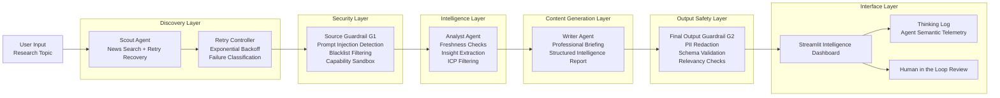

# AI Intelligence Bureau

Track A: Intelligence Bureau

This repository contains a multi-agent AI news intelligence system for researching a topic, filtering unsafe or untrusted content, extracting concise insights, and presenting a professional briefing in a Streamlit interface.

The primary implementation lives in the `ai-news-swarm` subproject. The repository root also includes lightweight `agents`, `tools`, and `app` folders so the hackathon submission structure is visible at the top level.

## What The System Does

The workflow is designed for agentic research rather than a single one-shot prompt.

1. A Scout agent searches for relevant, recent articles.
2. The search layer retries with fallback queries if the first search fails or returns no results.
3. A guardrail removes untrusted or unsafe content before analysis.
4. An Analyst agent marks stale content and extracts five key insights.
5. A Writer agent produces the final intelligence briefing.
6. A final guardrail blocks unsafe output before anything is shown to the user.

## System Architecture Diagram




The diagram source is also saved in `architecture.mmd`.


## Agent Roles

- Scout Agent: gathers recent articles and recovers from search failures by trying fallback queries.
- Analyst Agent: annotates article freshness and extracts five concise insights.
- Writer Agent: formats the final report into title, key insights, image references, and summary.
- Guardrail Layer: blocks untrusted sources and unsafe generated output.

## Guardrails

Current checks:

- Untrusted source blacklist
- Offensive output filter
- Early filtering during scouting
- Final blocking before rendering the report


## Run The Project

From `ai-news-swarm`:

```bash
pip install -r requirements.txt
set TAVILY_API_KEY=your_tavily_api_key
set GOOGLE_API_KEY=your_google_api_key
streamlit run app/streamlit_app.py
```

Optional ADK web mode:

```bash
adk web --adk_apps_dir .
```

## Demo Guidance

For the hackathon video:

- keep the video under 150 seconds
- set the YouTube video to Unlisted
- show the thinking log during generation
- trigger or describe a failed search so the fallback recovery is visible
- show a guardrail block example if possible
